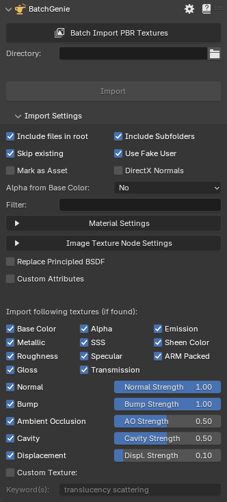
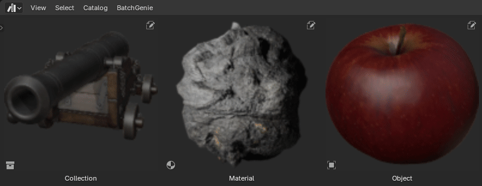

---
hide:
  - navigation
  - toc
  - title
  - footer
---
# <!-- This removes the title -->
Welcome to **BatchGenie**, an add-on designed to simplify and automate common Asset related tasks in Blender.

## Key Features

- **Batch Import PBR Textures**: BatchGenie streamlines PBR texture importing with a single click, offering robust customization options for bulk imports, saving you time and effort while tailoring imports to your preferences.
- **Batch Render Asset Previews**: Create high-quality previews for your Assets, including materials, objects, and collections, to showcase them externally or enhance your Asset library, ensuring it is visually informative and easy to browse.
- **Batch Utilities**: Utilize a variety of batch processing utilities designed to handle common tasks efficiently such as changing material or node attributes.

     
    **For a full breakdown of all features, check the "Full Feature List" section at the bottom.**

---

### Importing Textures

{ .img-box align=left}

<figure markdown="span">
  { .img-box .on-glb  data-title="Example of an import with various additional accessory nodes." data-description="These nodes are automatically added by BatchGenie when needed, such as converting normals and performing other necessary adjustments."}
  <figcaption>Example of an import with various additional accessory nodes.</figcaption>
</figure>

### Rendering Asset Previews

<!--

-   :material-clock-fast:{ .lg .middle } __Materials__

    ---

    Install [`mkdocs-material`](#) with [`pip`](#) and get up
    and running in minutes

    [:octicons-arrow-right-24: Getting started](#)

-   :fontawesome-brands-markdown:{ .lg .middle } __It's just Markdown__

    ---

    Focus on your content and generate a responsive and searchable static site

    [:octicons-arrow-right-24: Reference](#)

-   :material-format-font:{ .lg .middle } __Made to measure__

    ---

    Change the colors, fonts, language, icons, logo and more with a few lines

    [:octicons-arrow-right-24: Customization](#)

-   :material-scale-balance:{ .lg .middle } __Open Source, MIT__

    ---

    Material for MkDocs is licensed under MIT and available on [GitHub]

    [:octicons-arrow-right-24: License](#)

 -->

Render either through the BatchGenie panel or via Asset Browser

{ .img-box }

{ .img-box }

---

## Documentation

Extensive documentation is available [here](https://roberddd.github.io/BatchGenie).

## Full Feature List

- Easy one-click interface for instant use, while offering advanced customization options.
- Both rendering and all utilities work with local and external Assets, so you don't have to open each Asset file individually when working with them.

- **Texture Import**:
    - Blazingly fast imports.
    - Supports both Metallic/Roughness and Specular/Glossiness workflow.
    - Supports for 16+ types of maps: Albedo, Metallic, Roughness, Gloss, Alpha, Subsurface Scattering, Specular, Transmission, Emission, Sheen Color, Normal, Bump, Ambient Occlusion, Cavity, Displacement, and PACKED & CUSTOM types.
        - Packed: ARM/ORM/RMA textures that combine AO, Roughness, and Metallic maps.
        - Custom: Import any map and connect it to your chosen input via a dropdown menu.
    - Automatically sets up all necessary nodes, including color space adjustments and other configurations for a smooth workflow without manual intervention. This includes detecting normal map format and adding conversion nodes if needed, as well as auto-detecting the alpha channel from the Albedo texture to use its alpha channel if available.
    - Supports all combinations of Normal, Bump & Displacement maps.
    - Flexibly adjust the strength of Normal, Bump, Displacement, and Ambient Occlusion maps during import with the added convenience of bulk updates afterwards if needed.
    - Logic adept at deciphering complex texture naming conventions and avoiding duplicates of similar maps such as Roughness & Gloss.
    - Ability to designate a custom node-group to substitute the Principled BSDF shader in imported materials, enabling precise material customization during the import process.
    - Custom Input Socket Attributes: This feature enables you to define attributes for any input socket on the main shader of imported textures. You can assign specific colors or values, or utilize randomly generated values as required, including both whole numbers and decimals. This can be particularly useful for populating 'Seed' sockets.
    - Supports a mix of subfolders and files, allowing processing of textures located in both the root folder and subfolders.

- **Asset Preview Rendering**:
    - One click batch rendering making the process swift and efficient.
    - Supports rendering of multiple types of Assets: materials, collections, and objects, including VDB volumes
    - Seamless Asset Browser integration allows you to easily select and render images for your existing Assets. You can render any combination of different Asset types, including materials, objects, and collections.
    - Advanced filtering to find and replace missing or low-quality Asset Previews for both newly imported Assets and your existing Asset Library.
    - Easy controls for light and background settings to tailor the images to your liking.
    - Render to external locations: Expand beyond Asset previews by saving images externally, facilitating the quick creation of professional showcase images for your Assets.

- **Utilities**:
    - Tools for bulk updating material settings such as Displacement and eevee specific settings.
    - Node Attribute Changer: Target various nodes or custom node-groups within materials to change socket values, set specific colors, or use random values for seed sockets.
    - Replace Node Utility: Replace existing 'Shader Editor' nodes with custom Node-Groups.
    - Unconnected Nodes Finder: Identify unconnected nodes within materials and batch delete them if needed.
    - Find Zero Strength Nodes: Search for Normal Map, Bump, and Displacement nodes with zero values, potentially affecting material appearance.
    - Color Space Validator: Verifies image textures for correct color space settings, with an option to automatically fix any issues.
    - Reload Images: Update externally edited images in Blender, ensuring they refresh correctly.
    - Tagging Utilities: Easily add and remove tags for Assets in the Asset Browser. The Smart Tag feature lets you choose to add tags like dimensions, triangle and vertex counts, and texture resolution, offering detailed Asset information.
    - Metadata Adjustment: Easily adjust metadata in the Asset Browser, allowing batch additions of description, license, copyright, and author.
    - Move Asset: Organize your Assets efficiently by moving them to the correct Asset Catalogs with a single click, without having to open each individual Asset Blend file.
    - Plus a few other small utilities!