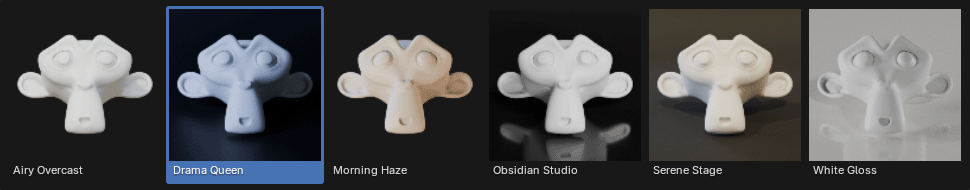
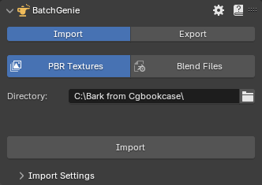
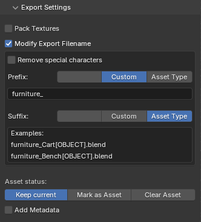
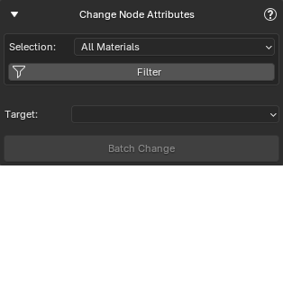
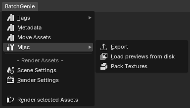

---
hide:
  - navigation
  - toc
  - title
  - footer
---

**BatchGenie** is an add-on designed to simplify and automate common asset-related tasks in Blender and help you build your asset library.

# Key Features {style="margin-top:0"}

-   :material-camera:{ .lg .middle style="color:var(--main-accent-color-green)" } __Batch Render Assets__

    ---

    Create high-quality previews for your Assets, including materials, objects, and collections, to showcase them externally or enhance your Asset library, ensuring it is visually informative and easy to browse.

-   :material-import:{ .lg .middle style="color:var(--main-accent-color-red)" } __Batch Import__

    ---

    Streamlined asset importing with a single click, including PBR textures and more, offering robust customization options for bulk imports to save time and effort while tailoring the process to your preferences.

-   :material-export-variant:{ .lg .middle style="color:var(--main-accent-color-orange)" } __Batch Export__

    ---

    Batch export objects, collections, and materials directly from the Asset Browser, streamlining your workflow and ensuring your assets are ready for use in any project.

-   :material-tools:{ .lg .middle style="color:var(--main-accent-color-blue)" } __Batch Utilities__

    ---

    Utilize a variety of batch processing utilities designed to handle common tasks efficiently such as changing material or node attributes.

For a full breakdown of all features, check the '**Feature Summary**' section at the bottom.

## :material-camera:{style="color:var(--main-accent-color-green); font-size: 1.8rem;"}  Rendering Asset Previews

You can either utilize Batch Rendering through the BatchGenie panel, or selectively choose Assets **from the Asset Browser** for which you wish to render previews for. BatchGenie supports rendering previews for **materials**, **collections**, and **objects**, including VDB volumes.

<video width="69%" loop autoplay muted style="float:left; margin:-0.5em 0.75em 0 0;">
    <source src="videos/render.mp4" type="video/mp4">
    Your browser does not support the video tag.
</video>

   :material-chevron-left: When rendering via the Asset Browser, you can work with **both internal and external Assets**, so you don't have to open each individual Asset Blend file separately.

{ .img-box align=right style="margin-bottom:0"}

  :material-chevron-right: **Advanced filtering** to find and replace missing or low-quality Asset Previews for both newly imported Assets and your existing Asset Library.

#### Settings

Easy controls for light and background settings, along with ready-to-use presets, allow you to tailor the images to your liking.

{ .img-box align=left }

{ .img-box }

<!-- 

:material-chevron-left: You can access the settings through both the BatchGenie panel and the BatchGenie menu in the Asset Browser. -->

 :material-chevron-down: **Presets, Lighting and Studio setups**.

{ .img-box  style="margin-top:-.5em;" }

{ .img-box  style="margin-top:-.95em; margin-bottom:-.95em" }

{ .img-box }

 <!-- Render section end -->

## :material-import:{style="color:var(--main-accent-color-red); font-size: 1.8rem;"} Importing

Importing is as simple as one click, with extensive customization available. Choose between **PBR Textures** and **Blend Files**: import texture sets from a folder as ready-to-use materials or batch import objects, collections, and materials from multiple blend files.

### :material-image-multiple:{style="color:var(--main-accent-color-red); font-size: 1.1rem;"} Importing PBR Textures

Supports for over 16 texture types, with fully automated setup for nodes, color space adjustments, and other configurations.

{ .img-box  align=left }

#### Fast Imports

With default settings, importing a folder containing 183 different 4K and 8K texture sets (a total of 725 images and 50GB) takes under 3 seconds.

{ .img-box align=right width=40% style="margin-top:-.5em; " }

#### Advanced Options :material-chevron-right:

The image to the right highlights many of the available options, while the paragraphs below provide brief explanations of some of the more advanced or less obvious functions.

---

##### - Replace Principled BSDF { style="margin-bottom:-0.75em;" }

Use a custom Node-Group instead of a Principled BSDF for the imported materials. Easily pick from a dropdown that shows all Node-Groups in the current blend file. This enables precise material customization during the import process.

---

##### - Custom Attributes { style="margin-bottom:-0.75em;" }

Set one or multiple socket attributes such as color or values during import.

---

##### - Custom Texture { style="margin-bottom:-0.75em;" }

Import any map and connect it to your chosen input via a dropdown menu. Supports packed textures.

---

*More import related settings can be found in the add-on preferences.*

<figure markdown="span">
  { .img-box style="margin-top:-1em" }
  <figcaption style="margin-top:0.25em">Example of an import with various additional accessory nodes.</figcaption>
</figure>

### :material-blender-software:{style="color:var(--main-accent-color-red); font-size: 1.1rem;"} Importing Blend Files

.gif){ .img-box  align=right }

Import **objects**, **collections**, and **materials** from multiple blend files at once. This feature is designed to streamline asset management by letting you quickly gather specific asset types from various blend files into your current project.

 <!-- IMPORT section end -->

## :material-export-variant:{style="color:var(--main-accent-color-orange); font-size: 1.8rem;"} Exporting

Batch export **objects**, **collections**, and **materials**. Work either directly from the 3D viewport or via the **Asset Browser**, it's as easy as point and click.

{ .img-box .margin-tight-horizontal align=left } { .img-box .margin-tight-horizontal align=left  }

{ .img-box align=left style="margin-top:-1em"}

:material-chevron-left: You can either export your items into one folder or keep the Outliner Hierarchy if needed.

 <!-- Export section end -->

## :material-tools:{style="color:var(--main-accent-color-blue); font-size: 1.8rem;"}  Batch Utilities

Utilities for efficiently managing materials and other assets. These tools work with both **local assets** in the current file **and external assets** through the Asset Browser, eliminating the need to open each individual Blend file separately. Built-in **parallel processing** when working with external assets, allowing multiple assets to be processed simultaneously in the background.

### Change Node Attributes

{ .img-box-top align=left }

Batch modify attributes across multiple materials. It's useful for making consistent adjustments to properties like roughness, metallic, or any other material attribute.

Target specific nodes or socket such as: Shader Nodes, Texture Nodes, Displacement Nodes, Normal Map Nodes, Bump Nodes, Seed Sockets and change any values.

---

### Change Material Settings

{ .img-box-top align=right }

Batch modify material settings across materials such as: Displacement Type, Eevee Backface Culling, Eevee Transparent Shadows, Eevee Render Method, Eevee Raytrace Transmission, Eevee Thickness and Viewport Display Color(Set the 'Viewport Display Color' of the material to match the 'Base Color' attribute of the main shader.)

---

### Replace Shader Nodes

{ .img-box align=left }

Replace existing 'Shader Editor' nodes with custom Node-Groups. It targets the main shader connected to the 'Material Output' within the material.

:material-chevron-left: **Filtering:** Many utilities offer filtering options to help target the correct Assets.

---

### Find Unconnected Nodes

{ .img-box align=right }

Locate materials with unconnected nodes in your file, such as Image Texture nodes.

---

### Find Zero Strength Nodes

{ .img-box align=left }

Finds nodes with critical values set to zero, which may negatively affect the appearance of your materials. You can select specific node types to check: For Normal Map and Bump nodes, it checks if 'Strength' is zero; for Displacement nodes, it verifies if 'Scale' is zero. This helps ensure that your materials function as intended.

---

### Color Space Validator

{ .img-box align=right }

Verifies that the image textures within materials in your file are using the correct color space settings, generates reports on its findings, and provides an option to **automatically** fix any issues.

---

### Batch Rename

{ .img-box align=left }

This utility includes options for aligning mesh names with object names and syncing image names with file names, making it particularly useful for imported assets with inconsistent naming conventions.

---

### Reload Images

{ .img-box align=right }

If you have edited any of your textures externally and the changes are not visible in Blender, use this utility to reload all images in your your file.

---

### Set Origin

<!-- { .img-box align=left } -->

<video width="74%" loop autoplay muted style="float:left">
    <source src="videos/utility_set-origin[900px].mp4" type="video/mp4">
    Your browser does not support the video tag.
</video>

Adjust the origin of objects to the minimum, maximum, or center along the X, Y, or Z axis.

---

### Asset Browser - Manage Asset Tags

Add or remove tags from your Assets. Select any number of Assets of any type, choose the desired tags to add, and BatchGenie will assign them to the appropriate Assets. These can be either regular tags or **Smart Tags** that apply the property of your choice to the Asset.

#### Add Tags

{ .img-box .margin-tight-vertical align=left }
{ .img-box .margin-tight-vertical align=left }
{ .img-box .margin-tight-vertical align=left }
{ .img-box .margin-tight-vertical align=left }
{ .img-box .margin-tight-vertical align=left }
{ .img-box .margin-tight-vertical align=left }

#### Combine / Split Tags

{ .img-box .margin-tight-vertical align=left }

Combine or split existing tags on Assets. Combine single-word tags into a single line, separated by commas (e.g., "tag1, tag2, tag3"). The split function reverses this, separating combined tags.

#### Remove Tags

{ .img-box-top .margin-tight-vertical align=left }

Remove existing tags from your assets. You can either select from a dropdown of existing tags, perform a keyword search, or target BatchGenie-applied Smart Tags for removal.

---

### Asset Browser - Manage Metadata

{ .img-box .margin-tight-vertical align=left }

Add metadata to your Assets. You can select and edit one or multiple attributes simultaneously.

---

### Asset Browser - Move Assets

Move Assets to different Asset Catalogs to help you organize your Asset Library. Remember, BatchGenie handles **both internal and external assets**, so there's no need to open each individual Asset Blend file when moving assets around.

{ .img-box align=left }

{ .img-box align=left }

---

### Asset Browser - Misc Utilities

{ .img-box align=left }

#### Export

Export selected assets, see the 'Export' section for more details.

#### Load previews from disk

Batch load custom Asset Preview images from a specified directory.

#### Pack Textures

This feature packs all associated textures into their respective blend files, ensuring that your assets retain their appearance without the need for external texture files.

---

### Shader Editor Utilities

There are also versions of the '**Replace Shader Nodes**' and '**Find Zero Strength Nodes**' utilities available inside the Shader Editor, specifically designed for processing individual materials rather than batch adjustments.

 <!-- Utilities section end -->

# Documentation

Extensive documentation is available [here](https://roberddd.github.io/BatchGenie){target="_blank"}, along with a detailed video instruction to guide you through the features.

For details about the current version and updates, check the [Changelog](https://batchgenie.roberd.net/changelog/){target="_blank"}.

# Feature Summary

- Easy one-click interface for instant use, while offering advanced customization options.
- Both rendering and all utilities work with local and external Assets, so you don't have to open each Asset file individually when working with them.
- Built-in parallel processing when working with external assets, allowing multiple assets to be processed simultaneously in the background.

- **Asset Preview Rendering**:
    - One click batch rendering making the process swift and efficient.
    - Supports rendering of multiple types of Assets: materials, collections, and objects, including VDB volumes.
    - Seamless Asset Browser integration allows you to easily select and render images for your existing Assets. You can render any combination of different Asset types, including materials, objects, and collections.
    - Advanced filtering to find and replace missing or low-quality Asset Previews for both newly imported Assets and your existing Asset Library.
    - Easy controls for lighting and background settings, enhanced with Render Presets to streamline setup. You can choose from ready-to-use lighting configurations that automatically adjust light parameters, including support for HDRI images.
    - Render to external locations: Expand beyond Asset previews by saving images externally, facilitating the quick creation of professional showcase images for your Assets.

- **Importing**:
    - **Texture Import**:
        - Blazingly fast imports.
        - Supports both Metallic/Roughness and Specular/Glossiness workflow.
        - Supports for 16+ types of maps: Albedo, Metallic, Roughness, Gloss, Alpha, Subsurface Scattering, Specular, Transmission, Emission, Sheen Color, Normal, Bump, Ambient Occlusion, Cavity, Displacement, and PACKED & CUSTOM types.
            - Packed: ARM/ORM/RMA textures that combine AO, Roughness, and Metallic maps.
            - Custom: Import any map and connect it to your chosen input via a dropdown menu. Supports packed textures.
        - Automatically sets up all necessary nodes, including color space adjustments and other configurations for a smooth workflow without manual intervention. This includes detecting normal map format and adding conversion nodes if needed, as well as auto-detecting the alpha channel from the Albedo texture to use its alpha channel if available.
        - Supports all combinations of Normal, Bump & Displacement maps.
        - Flexibly adjust the strength of Normal, Bump, Displacement, Ambient Occlusion and Cavity maps during import with the added convenience of bulk updates afterwards if needed.
        - Logic adept at deciphering complex texture naming conventions and avoiding duplicates of similar maps such as Roughness & Gloss.
        - Ability to designate a custom node-group to substitute the Principled BSDF shader in imported materials, enabling precise material customization during the import process.
        - Custom Input Socket Attributes: This feature enables you to define attributes for any input socket on the main shader of imported textures. You can assign specific colors or values, or utilize randomly generated values as required, including both whole numbers and decimals. This can be particularly useful for populating 'Seed' sockets.
        - Supports a mix of subfolders and files, allowing processing of textures located in both the root folder and subfolders.
    - **Blend File Import**:
        - Import objects, collections, and materials from multiple blend files at once.

- **Exporting**:
    - Batch export objects, collections, and materials to blend files with ease. You can choose to export them as individual blend files or combine all selected assets into a single blend file. This feature is directly integrated into the Asset Browser for seamless access and functionality.

- **Utilities**:
    - Utilities are available for working with your current blend file and are integrated into the Asset Browser for quick access.
    - Tools for bulk updating material settings such as Displacement and eevee specific settings.
    - Node Attribute Changer: Target various nodes or custom node-groups within materials to change socket values, set specific colors, or use random values for seed sockets.
    - Replace Node Utility: Replace existing 'Shader Editor' nodes with custom Node-Groups.
    - Unconnected Nodes Finder: Identify unconnected nodes within materials and batch delete them if needed.
    - Find Zero Strength Nodes: Search for Normal Map, Bump, and Displacement nodes with zero values, potentially affecting material appearance.
    - Color Space Validator: Verifies image textures for correct color space settings, with an option to automatically fix any issues.
    - Reload Images: Update externally edited images in Blender, ensuring they refresh correctly.
    - Tagging Utilities: Easily add and remove tags for Assets in the Asset Browser. The Smart Tag feature lets you choose to add tags like dimensions, triangle and vertex counts, and texture resolution, offering detailed Asset information.
    - Metadata Adjustment: Easily adjust metadata in the Asset Browser, allowing batch additions of description, license, copyright, and author.
    - Move Asset: Organize your Assets efficiently by moving them to the correct Asset Catalogs with a single click, without having to open each individual Asset Blend file.
    - Load previews from disk:  Directly load custom asset preview images from a specified directory.
    - Pack Textures: Easily pack textures for assets in the Asset Browser with a single click.
    - Set Origin: Quickly set object origins.
    - Plus a few other small utilities!